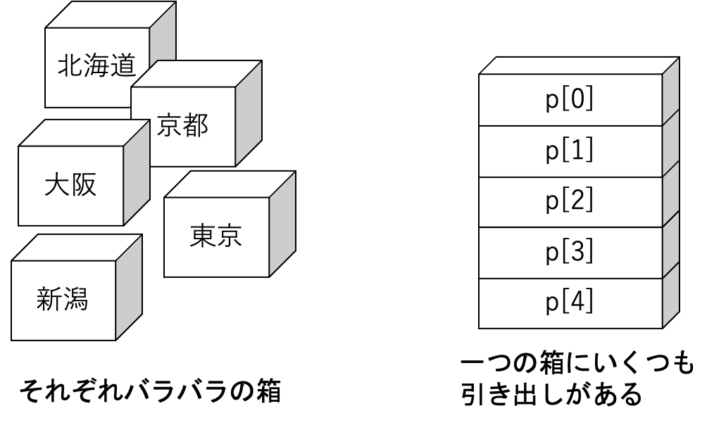

# 配列

ごめんさい，サイトの更新全然できません．．．．．

## 配列とは

同じ型の変数をたくさん宣言するのは大変です．下のプログラムを見てみましょう．

```c
#include <stdio.h>

int main(void)
{
    int niigata;    /*新潟の人口*/
    int tokyo;      /*東京の人口*/
    int osaka;      /*大阪の人口*/
    int kyoto;      /*京都の人口*/
    int hokkaido;   /*北海道の人口*/
    int sum = 0;    /*合計*/

    printf("各都道府県の人口\n");
    printf("新潟県 :"); scanf("%d", &niigata); sum += niigata;
    printf("東京都 :"); scanf("%d", &tokyo); sum += tokyo;
    printf("大阪府 :"); scanf("%d", &osaka); sum += osaka;
    printf("京都府 :"); scanf("%d", &kyoto); sum += kyoto;
    printf("北海道 :"); scanf("%d", &hokkaido); sum += hokkaido;

    printf("人口の合計 :%d人\n", sum);
    printf("平均人口 : 約%.0f人\n",(float)sum/5);

    return 0;
}
```

```shell
各都道府県の人口
新潟県 :2304264
東京都 :13515271
大阪府 :8839469
京都府 :2610353
北海道 :5381733
人口の合計 :32651090人
```

このように今までは各県（変数）を宣言してプログラムを行っていました．

これからは今回でいうと人口のように同じジャンルの変数がたくさん必要なときに便利なのが配列です．

```c
#include <stdio.h>

int main(void)
{
    int p[5];   /*5つ分の配列を宣言*/
    int sum = 0;    /*合計*/

    printf("各都道府県の人口\n");
    printf("新潟県 :"); scanf("%d", &p[0]); sum += p[0];
    printf("東京都 :"); scanf("%d", &p[1]); sum += p[1];
    printf("大阪府 :"); scanf("%d", &p[2]); sum += p[2];
    printf("京都府 :"); scanf("%d", &p[3]); sum += p[3];
    printf("北海道 :"); scanf("%d", &p[4]); sum += p[4];

    printf("人口の合計 : %d人\n", sum);
    printf("平均人口 : 約%.0f人\n",(float)sum/5);

    return 0;
}
```

```shell
各都道府県の人口
新潟県 :2304264
東京都 :13515271
大阪府 :8839469
京都府 :2610353
北海道 :5381733
人口の合計 :32651090人
```

各都道府県ひとつひとつの変数を作成していましたが今回のプログラムでは，

```c
int p[5];
```

で5つ分用意されました．



一つ一つ変数を定義する方法では，箱がそれぞれ用意されますが今回は引き出しを5つ用意しました．

配列を指定して読み出す事もできます．

```c
#include <stdio.h>

int main(void)
{
    int p[5];   /*5つ分の配列を宣言*/
    int i;

    for (i = 0; i < 5; i++)
    {
        p[i] = i + 1;
    } /*1,2,3と配列に入力していく*/
    
    printf("1つ目の配列の値 :%d\n", p[0]); //1つ目の配列の値を読み出し
    printf("4つ目の配列の値 :%d\n", p[3]); //4つ目の配列の値を読み出し

    return 0;
}
```

```shell
1つ目の配列の値 :1
4つ目の配列の値 :4
```

## for文と組み合わせる

配列はfor文などのループ処理と組み合わせて使うことが多いです．
上のプログラムでも代入する処理がありましたが，`scanf()`も
同じようにかくことができます．

```c
#include <stdio.h>

int main(void)
{
    // 学生数の宣言
    int num;
    printf("学生数：");scanf("%d",&num);

    // 学生の数だけ配列を用意
    int score[num];   /*人数分の配列を宣言*/
    int sum = 0;    /*学生の合計点を代入*/

    // 学生の点数を入力する処理
    int i;
    for (i = 1; i <= num; i++)
    {
        printf("学生%dの点数:",i);
        scanf("%d",&score[i]);//i番目の学生の点数を入力
        sum += score[i];
    }
    
    printf("%d人の学生の合計点数 :%d\n", num, sum); 
    printf("%d人の学生の平均点数 :%d\n", num, sum/num); 

    return 0;
}
```

```shell
学生数：3
学生1の点数:50 
学生2の点数:60
学生3の点数:70
3人の学生の合計点数 :180
3人の学生の平均点数 :60
```

## 課題

* 下のように任意の学生数の点数を入力し，最高点と最低点を出力するプログラムを作成してください．
* 点数は配列に代入してください．
  
```shell
学生数 : 3
学生 1 : 40
学生 2 : 50
学生 3 : 60
最高点 : 60点
最低点 : 50点
```

完成したら担当の先輩に提出してください.

## 追加課題
*  課題本文は [`プログラミング練習配列.pdf`](プログラミング練習配列.pdf)
*  応用問題の参考動画は[`【大学数学】線形代数入門②(行列)【線形代数】`](https://youtu.be/ltFl0FpLTzQ),応用問題の参考サイトは[`転置行列の意味・重要な 7 つ の 性 質 と 証 明 | 高 校 数 学 の 美 し い 物 語`](https://manabitimes.jp/math/1046)
*  プログラム例1
```c
// 4人の学生の3科目のテスト結果を表示 
#include <stdio.h>
int main(void)
{
int tensu1[4][3] = {{ 91, 63, 78}, { 67, 72, 46}, { 89, 34, 53}, { 32, 54, 34} }; 
int tensu2[4][3] = { { 97, 67, 82}, { 73, 43, 46}, { 97, 56, 21}, { 85, 46, 35} } ;
​
//1回目の点数を表示
puts("1回目の点数"); 
for ( int i = 0; i < 4; i++)		//4人分の
{
for ( int j = 0; j < 3; j++)		//3科目の
printf("%4d", tensu1[i][j]);		//点数を表示
putchar ('\n'); 
}
​
//2回目の点数を表示
puts("2回目の点数"); 
for ( int i = 0; i < 4; i++)
{
for ( int j = 0; j < 3; j++)
printf ("%4d", tensu2[i][j]); 
putchar ('\n'); 
}
​
return 0;
}
```
* プログラム例2
```c
// 学生の点数を読み込んで合計点と平均点を表示（人数をマクロで定義） 
#include <stdio.h>
#define NUMBER 5	//学生の人数
int main(void)
{
 int tensu[NUMBER];	//学生の点数
 int sum = 0;		//合計点
​
 printf("%d人の点数を入力せよ。\n", NUMBER); 
 for ( int i = 0; i < NUMBER; i++)
 {
  printf("%2d番：", i + 1);
  scanf("%d",&tensu[i]);
  sum += tensu[i]; 
 }
 printf ("合計点：%5d\n", sum);
 printf ("平均点：%5.1f\n", (double) sum / NUMBER); 
 return 0;
}
```

*  提出は不要です.

