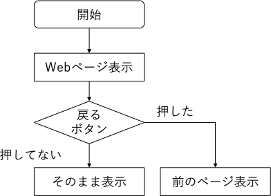
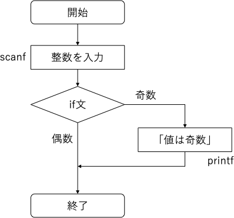

# if文

アプリを使用しているときなど意識はしたことはないと思いますが，プログラムでは色々な条件分岐というものをしています．

例えば「ブラウザで戻るボタンを押すと前のページに戻る」など当たり前のように感じる一連の動作がありますが，これは「もしも戻るボタンが押されたら前のページにもどる．もし押されていない場合は待機する」というようになっています．



図示すると上のようになります．このような図をフローチャートといいます．図のひし形の部分を条件分岐といいます．

## 「もし」で実行するif文のプログラム

上のようにボタンの状態で動きが変わるものの一つにif文というものがあります．
ここでは「もし入力した値が奇数ならhelloと表示する」というプログラム[if_odd.c](if_odd.c)を作成します．

```c
#include <stdio.h>

int main(void)
{
    int n;

    printf("整数を入力してください：");
    scanf("%d", &n);

    if (n % 2)     //条件分岐「もしも奇数なら波カッコ内を実行」
    {
        printf("値は奇数\n");
    }

    return 0;
}
```

実際に実行してみると奇数を入力したときは「値は奇数」と表示され，偶数を入力したときは何も表示されずプログラムは終了します．

プログラムを見ると

```c
if(n % 2)
{
    printf("値は奇数\n");
}
```

という部分があると思います．この部分が「もし入力した値が奇数なら「値は奇数」と表示する」という条件分岐です．

if文は

```c
if(制御式)
{
    //プログラム
}
```

のように書きます．

if文は制御式の値が0でない場合に波カッコ内のプログラムを実行します．

[if_odd.c](if_odd.c)の場合は

```c
n % 2
```

という制御式があり，偶数のときは余りが0になり波カッコ内のプログラムは実行されず，奇数のときは余りが1になるため波カッコないのプログラムが実行されるため，奇数が入力されると「値は奇数」と表示します．

これをフローチャートに表すと以下のようになります．



## 「〜でなければ」で実行するif文のプログラム

上のようなif文では「もし」のときしか実行できないですね．値が偶数のときに「値は偶数」と表示するためには[if_odd.c](if_odd.c)に`else`文というものを追加します（[if_odd_even.c](if_odd_even.c)）．

```c
#include <stdio.h>

int main(void)
{
    int n;

    printf("整数を入力してください：");
    scanf("%d", &n);

    if (n % 2)     //条件分岐「もしも奇数なら波カッコ内を実行」
    {
        printf("値は奇数\n");
    }
    else           //上の条件に当てはならない場合に実行
    {
        printf("値は偶数\n");
    }

    return 0;
}
```

`else`文というものが追加されていますね．`else`は「〜でなければ」という意味で`if`の条件に当てはまらないときに実行されるものです．

上のプログラムでは「奇数でなければ`else`の波カッコ内を実行」という意味で使われています．

## 制御式について

if文は制御式の値が1のときに実行するプログラムと言いました．
ここでは様々な制御式を紹介します．

### 等価演算子

2つの値が等しいときに実行するプログラム[if_equal.c](if_equal.c)．

```c
#include <stdio.h>

int main(void)
{
    int n, m;

    printf("2つの整数を入力してください：");
    scanf("%d%d", &n,&m);

    if (n == m)     //条件分岐「2つの値が等しいときに実行」
    {
        printf("値は等しい\n");
    }
    else           //上の条件に当てはならない場合に実行
    {
        printf("値は等しくない\n");
    }

    return 0;
}
```

2つの値が等しくない時に実行するプログラム[if_notequal.c](if_notequal.c)．

```c
#include <stdio.h>

int main(void)
{
    int n, m;

    puts("2つの整数を入力してください");
    printf("整数n");    scanf("%d", &n);
    printf("整数m");    scanf("%d", &m);

    if (n != m)     //条件分岐「2つの値が等しくないときに実行」
    {
        printf("値は等しくない\n");
    }
    else           //上の条件に当てはならない場合に実行
    {
        printf("値は等しい\n");
    }

    return 0;
}
```

|  | 書き方 | 機能 |
| - | - | - |
| 等しいとき実行 | n == m | nとmの値が等しいとき1，等しくないときは0を出力する制御式 |
| 等しくないときに実行 | n != m | nとmの値が等しくないとき1，等しいときは0を出力する制御式 |

### 関係演算子

数学で以上以下，より大きいより小さいをやったことがあると思います．同じようにプログラムでもそれを用いることがあります．

入力した整数の符号を判定するプログラムを以下に示す[if_pn.c](if_pn.c)．

```c
#include <stdio.h>

int main(void)
{
    int n;

    printf("整数を入力してください：");
    scanf("%d", &n);

    if (n == 0)     //条件分岐「値が0かどうか判別」
    {
        printf("値は0\n");
    }
    else if (n > 0) //条件分岐「値が正かどうか判別」
    {
        printf("値は正\n");
    }
    else            //上記の条件以外の場合実行
    {
        printf("値は負\n");
    }

    return 0;
}
```

|  | 書き方 | 機能 |
| - | - | - |
| より小さいときに実行 | n < m | nがmより小さいとき1，大きいときは0を出力する制御式 |
| より大きいときに実行 | n > m | nがmより大きいとき1，小さいときは0を出力する制御式 |
| 以下のときに実行 | n <= m | nがm以下のとき1，以上のときは0を出力する制御式 |
| 以上のときに実行 | n >= m | nがm以上のとき1，以下のときは0を出力する制御式 |

## else if

[if_pn.c](if_pn.c)では`else if`というものがでてきました．これは以下のようなフローチャートとなる．


`else if`は枠で囲まれている部分のことで「0じゃないとき，もし0より大きいか判別」という意味です．

## 練習問題

### 練習問題1

* 下のような絶対値を返すプログラムを作成してください．
* 見本は[`practice3_1_1.c`](practice3_1_1.c)に記載してあります．

```shell
整数を入力してください：10
絶対値：10
```

```shell
整数を入力してください：-5
絶対値：5
```

### 練習問題2

* 下のような一番大きい数を返すプログラムを作成してください
* if文を使って大きい数を返してください．
* 見本は[`practice3_1_2.c`](practice3_1_2.c)に記載してあります．

```shell
3つの整数を入力してください：7 5 10
一番大きい値は10です．
```

## 今回の課題

* 下のような一番小さい数を返すプログラムを作成してください
* if文を使って小さい数を返してください．

```shell
3つの整数を入力してください：7 5 10
一番小さい値は5です．
```

堀のslackのDMに投げてください。 見たら何かしか返信します。(見るの遅くなったらごめんなさい)
